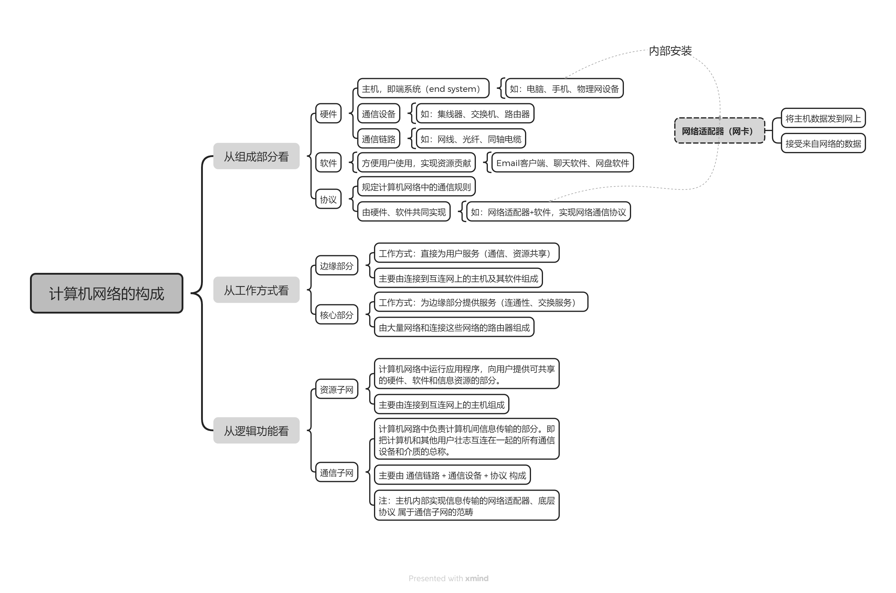
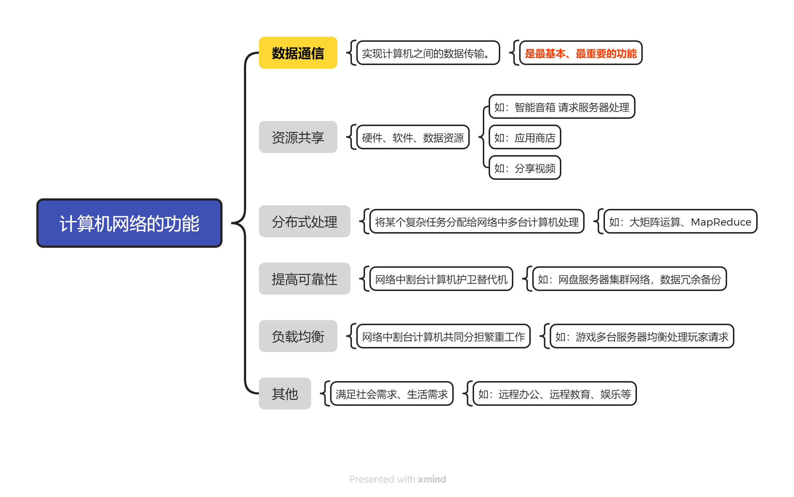

# **Computer Networks 计算机网络**
## 第一章 计算机网络体系结构
*时间：2026年4月14日 天气：小晴 心情：想去踢球没去成*
>今日学习目标：
>>- [ √ ]1.计算机网络的概念
>>- [ √ ]2.计算机网络的组成和功能
>>- [ ]3.电路交换、报文交换、分组交换
>>- [ ]4.三种交换方式的性能分析
### 1.计算机网络的概念
#### 章节概念
1. **计算机网络(Computer Networks，简称 网络)**：是一个将众多分散的、自治的计算机系统，通过通信设备与线路连接起来，由功能完善的软件实现资源共享和信息传递的系统。由若干个 **结点(node)** 和链接这些结点的 **链路(link)** 组成。
2. **结点** 可以是计算机、集线器、交换机、路由器等
3. **集线器(Hub)**：
    1. 可以把多个结点链接起来，组成一个计算机网络。
    2. 集线器工作在 **物理层(第一层)**。
4. **交换机(Switch)**:
    1. 可以把多个 **结点** 连接起来，组成一个计算机网络。
    2. 交换机可以和交换机相连，构建更大的计算机网络。
    3. 交换机工作在 **数据链路层(第二层)**。
5. **路由器(router)**:
    1. 可以把两个或多个 **计算机网络** 互相连接起来，形成更大的计算机网络，称为 **互连网**。
    2. 路由器可以连接路由器，构建更大的计算机网络。
    3. 路由器工作在 **网络层(第三层)**。
##### 路由器连接的是网络，集线器和交换机连接的结点
6. **互联网(或因特网，Internet)**：由各大ISP(Internet Service Provider)和国际机构组件的，覆盖全球范围的 **互连网(internet)**.
7. **互联网** 必须使用 **TCP/IP协议** 通信，互连网可以使用任意协议进行通信。

### 2.计算机网络的组成和功能
#### 章节概念
1. **计算机网络的构成**

2. **计算机网络的功能**

