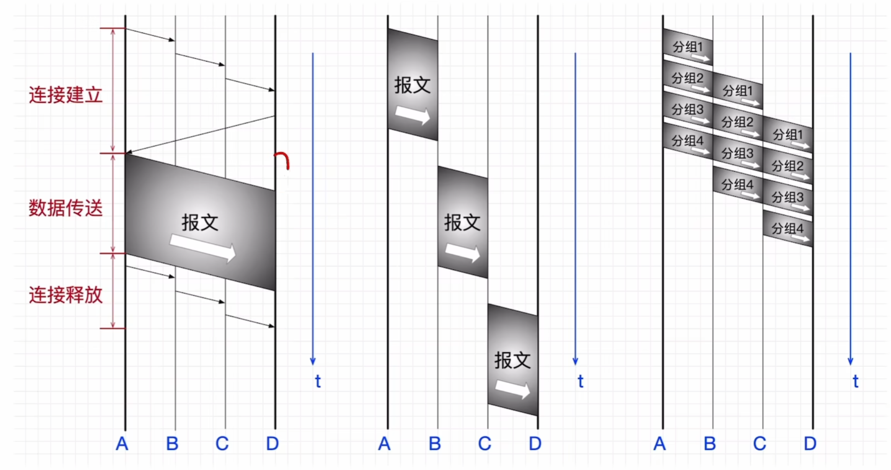
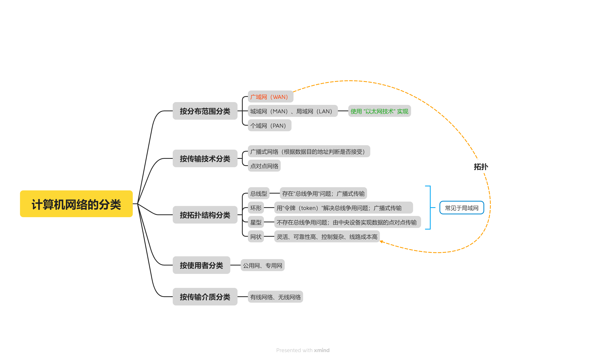
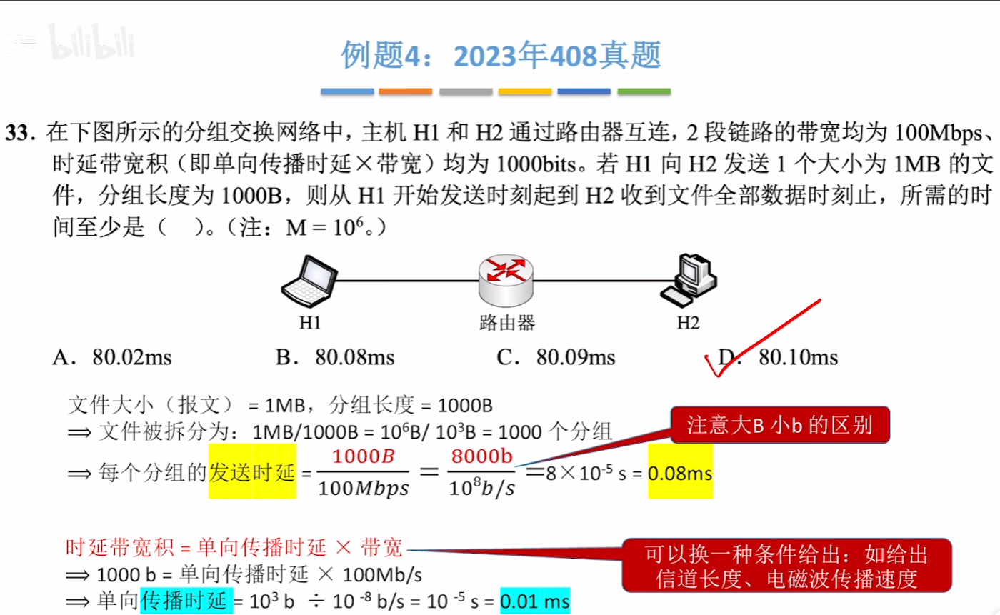
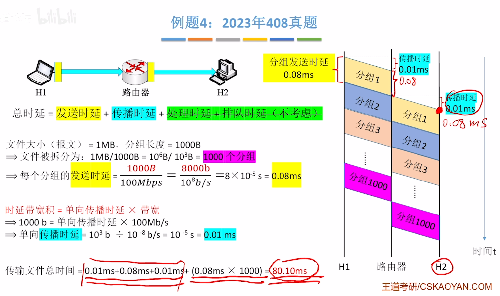
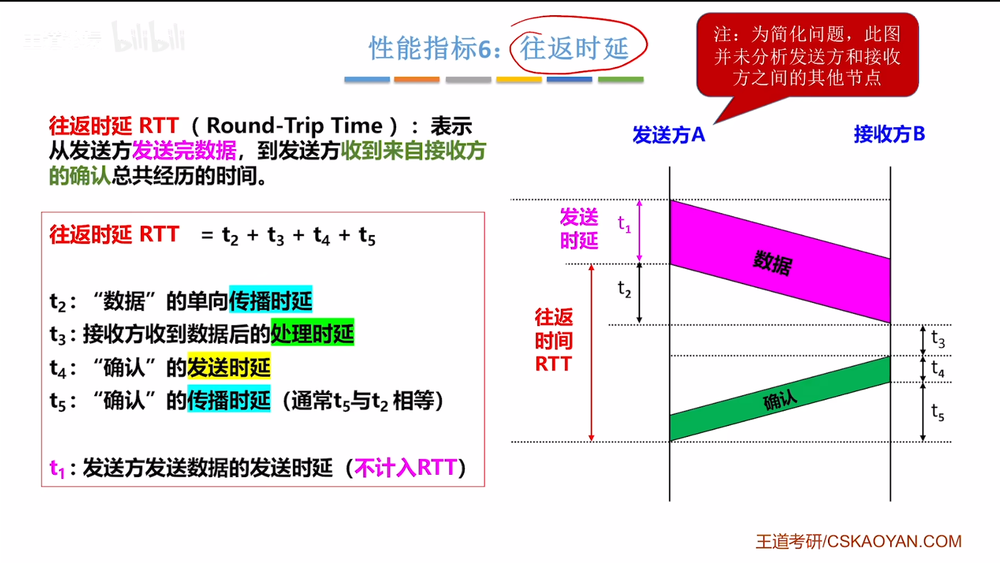

# **Computer Networks 计算机网络**
## 第一章 计算机网络体系结构
*第一天 时间：2026年4月14日 天气：小晴 心情：想去踢球没去成*
>今日学习目标：
>>- [√]1.计算机网络的概念
>>- [√]2.计算机网络的组成和功能

### 1.计算机网络的概念
#### 章节概念
1. **计算机网络(Computer Networks，简称 网络)**：是一个将众多分散的、自治的计算机系统，通过通信设备与线路连接起来，由功能完善的软件实现资源共享和信息传递的系统。由若干个 **结点(node)** 和链接这些结点的 **链路(link)** 组成。
2. **结点** 可以是计算机、集线器、交换机、路由器等
3. **集线器(Hub)**：
    1. 可以把多个结点链接起来，组成一个计算机网络。
    2. 集线器工作在 **物理层(第一层)**。
4. **交换机(Switch)**:
    1. 可以把多个 **结点** 连接起来，组成一个计算机网络。
    2. 交换机可以和交换机相连，构建更大的计算机网络。
    3. 交换机工作在 **数据链路层(第二层)**。
5. **路由器(router)**:
    1. 可以把两个或多个 **计算机网络** 互相连接起来，形成更大的计算机网络，称为 **互连网**。
    2. 路由器可以连接路由器，构建更大的计算机网络。
    3. 路由器工作在 **网络层(第三层)**。
##### 路由器连接的是网络，集线器和交换机连接的结点
6. **互联网(或因特网，Internet)**：由各大ISP(Internet Service Provider)和国际机构组件的，覆盖全球范围的 **互连网(internet)**.
7. **互联网** 必须使用 **TCP/IP协议** 通信，互连网可以使用任意协议进行通信。

### 2.计算机网络的组成和功能
#### 章节概念
1. **计算机网络的构成**

2. **计算机网络的功能**

*第二天 时间：2026年4月15日 天气：依旧晴 心情：不想改PPT*
>今日学习目标：
>>- [√]1.电路交换、报文交换、分组交换
>>- [√]2.三种交换方式的性能分析

### 1.电路交换、报文交换、分组交换
#### 章节概念
1. **电路交换**：
    1. 通过物理线路连接的形式，动态地分配传输线路资源
    2. **电话网络** 采用 “电路交换” 技术
    3. 电路交换的过程
        1. 建立连接（尝试占用通信资源）
        2. 通信（一直占用通信资源）
        3. 释放连接（归还通信资源）
    4. 优缺点：
        1. 优点：数据直送，传输效率高
        2. 缺点：建立/释放连接，需要额外的时间开销；线路被通信双方独占，利用率低；线路分配的灵活性差；交换节点不支持“差错控制”（无法发现传输过程中的数据错误）
    5. 电路交换更适合用于：**低频次、大量地**  传输数据
2. **报文交换**
    1. **电报网络** 采用报文交换技术
    2. 传输数据采用 **报文(message)**，包括控制信息（发送方/接收方）和用户数据（内容）
    3. 优缺点：
        1. 优点：通信前 **无需** 建立连接；数据以 **“报文”** 为单位被交换节点间 **“存储转发”**，通信线路可以灵活分配；在通信时间内，两个用户无需独占一整条物理路线。相比于电路交换，线路利用率高；交换节点支持“差错控制”（通过校验技术）
        2. 缺点：报文不定长，不方便存储转发管理；长报文的存储转发时间开销大、缓存开销大；长报文容易出错，重传代价高
3. **分组交换**
    1. 报文不定长，分组定长。分组的控制信息包括：源地址、目的地址；**分组号** 等
    2. 相比于报文交换，分组交换改进如下问题：
        1. 分组定长，方便存储转发管理
        2. 分组的存储转发时间开销小、缓存开销小
        2. 分组不易出错，重传代价低
    3. 优缺点：
        1. 优点：通信前 **无需** 建立连接；数据以 **分组** 为单位被交换节点间 **存储转发**，通信可以灵活分配；在通信时间内，两个用户 **无需独占** 一条物理线路。相比于电路交换，线路利用利率高；交换节点支持 **差错控制**（通过校验技术）
        2. 缺点：相比于报文交换，控制信息占比增加；相比于电路交换，依然存在存储转发时延；报文被拆分为多个分组，传输过程中可能出现 **失序、丢失** 等问题，增加处理的复杂度
4. **虚电路交换（基于分组交换，后续会学习）**
    1. 建立连接（虚拟电路）
    2. 通信（分组按序、按已建立好的既定线路发送，通信双方不独占线路）
    3. 释放连接
##### 现代计算机通信采用 分组交换 技术

#### 补充批注
1. **“三网”** 包括：电信网（电话网络）、广播电视网、互联网（计算机网络）

### 2.三种交换方式的性能分析
#### 章节概念
要明确三种交换方式的运行逻辑

**三种交换方式的性能分析**
||电路交换|报文交换|分组交换|
|----|----|----|----|
|**完成传输所需时间**|最少（排除建立/释放连接耗时）|最多|较少|
|存储转发时延|无|较高|较低|
|通信前是否需要建立连接|是|否|否|
|缓存开销|无|高|低|
|是否支持差错控制|不支持|支持|支持|
|报文数据有序到达|是|是|否|
|是否需要额外的控制信息|否|是|是（控制信息占比最大）|
|线路分配灵活性|不灵活|灵活|非常灵活|
|线路利用率|低|高|非常高|

*第三天 时间：2026年4月16日 天气：有点阴 心情：运动会停课，早上起不来*
>今日学习目标：
>>- [√]1.计算机网络的分类
>>- [√]2.计算机网络的性能指标

### 1.计算机网络的分类
#### 章节概念
1. **计算机网络的分类**：

### 2.计算机网络的性能指标
#### 章节概念
1. **信道**
    表示向某一方向传送信息的通道（信道≠通信线路），一条通信线路在逻辑上往往对应一条发送信道和一条接收信道
2. **速率(Speed)**
    1. 指连接到网络上的节点在 **信道** 上传输数据的速率。也称数据率或比特率、**数据传输速率**
    2. 速率单位：bit/s , b/s , **bps**
    3. **注意**： 
        1. 有时也会用 B/s(**1B=8b**，B=Byte字节，b=bit比特)
        2. **速率换算** 是10的3次方，**存储换算** 是2的10次方。单位：k M G T
3. **带宽(bandwidth)**
    1. 某信道所能传送的 **最高数据率**
    2. 节点间通信实际能达到的 **最高速率**，由带宽、节点性能共同限制
4. **吞吐量(Throughput)**
    1. 指单位时间内通过某个网络（或信道、接口）的 **实际数据量**。
    2. 吞吐量受带宽限制、受复杂的网络负载情况影响。
5. **时延(Delay)**
    1. 指数据（一个报文或分组，甚至比特）从网络（或链路）的一端传送到另一端所需的时间。又是也称为 **延迟** 或 **迟延**
    2. **总时延 = 发送时延 + 传播时延 + 处理时延 + 排队时延**
        1. **发送时延**：又名传输时延，节点将数据推向信道所花的时间。数据长度(bit)/发送速率(bit/s)
        2. **传播时延**：电磁波在信道中传播一定的距离所花的时间。**不为传输时延**。信道长度(m)/电磁波在信道中的传播速度(m/s)
        3. **处理时延**：被路由器处理所花的时间（如：分析首部、查找存储转发表）
        4. **排队时延**：数据排队进入、排队发出路由器所花的时间
        5. **路由器** 需要进行处理分组，即 **存储转发**，分组太多则需要排队
    3. **每经过一条信道，就会产生一次发送时延和一次传播时延；每经过一次中间节点，就会产生一次处理时延和排队时延**
6. **时延带宽积**
    1. **时延带宽积(bit) = 传播时延(s) * 带宽(bit/s)**
    2. 含义：一条链路中，已从发送端发出但尚未到达接收端的最大比特数
    3. 时延带宽积用于设计最短帧长（后续学习）
    4. **例题**
        
        
7. **往返时延RTT(Round-Trip Time)**
    1. 表示从发送方 **发送完数据**，到发送方 **收到来自接收方的确认** 总共经历的时间。
    2. **图解**
        
8. **信道利用率**
    1. 某个信道有百分之多少的时间是有数据通过的。
    2. 信道利用率 = 有数据通过的时间 / (有数据通过的时间 + 没有数据通过的时间)
    3. **补充**：
        1. 信道利用率 **不能太低，浪费资源**
        2. 信道利用率 **不能太高，容易导致网络拥塞** 

*第四天 时间：2026年4月18日 天气：晴的有点热 心情：困*
>今日学习目标：
>>- [√]1.计算机网络分层结构

### 1.计算机网络分层结构
#### 章节概念
1. **“分层”的设计思想**：将庞大而复杂的问题，转化为若干较小的局部问题。
2. **三种常见的计算机网络体系结构**：
    1. **OSI参考模型** （法律上的标准），由国际标准化组织ISO提出
        应用层->表示层->会话层->运输层->网络层->数据链路层->物理层
    2. **TCP/IP模型** （事实上的标准），美国国防部阿帕网（ARPANET）项目的后续成果
        应用层->传输层->网际层->网络接口层
    3. **五层模型** （教学用标准）
        应用层->传输层->网络层->数据链路层->物理层
3. **网络体系结构**：计算机网络的各层及其协议的**集合**，就是这个计算机网络及其构件所应完成的 **功能的精确定义（不涉及实现）**。
4. **实现**：遵循这种体系结构的前提下，用何种硬件或软件完成这些功能的问题。
5. **体系结构是抽象的，而实现则是具体的**
6. **实体**：在计算机网络的分层机构中，第n层中的活动元素（软件+硬件）通常成为第n层实体。不同机器上的同一层成为**对等层**，同一层的实体成为**对等实体**。
7. **协议**
    1. 即“网络协议”，是控制对等实体之间进行通信的规则的集合，**是水平的**。
    2. 三要素：**语法、语义、同步**
        1. 语法，数据与控制信息的格式（SDU、PCI的格式）
        2. 语义，需要发出何种控制信息、完成何种动作及做出何种应答
        3. 同步（**时序**），执行各种操作的条件、时序关系等，即时间实现顺序的详细说明
8. **接口**：即同一节点内**相邻两层的实体**交换信息的逻辑接口，又称为**服务访问点**。
9. **服务**：指下层为紧邻的上层提供的功能调用，**是垂直的**。
10. **PDU、SDU、PCI的概念**
    1. **协议数据单元（PDU）**：对等层次之间传送的数据单位。第n层的PDU记为 n-PDU
    2. **服务数据单元（SDU）**：为完成上一层实体所要求的功能而传送的数据。第n层的SDU记为n-SDU
    3. **协议控制信息（PCI）**：控制协议操作的信息。第n层的PCI记为n-PCI
    4. 三者的关系为 **n-SDU + n-PCI = n-PDU = (n-1)-SDU**
