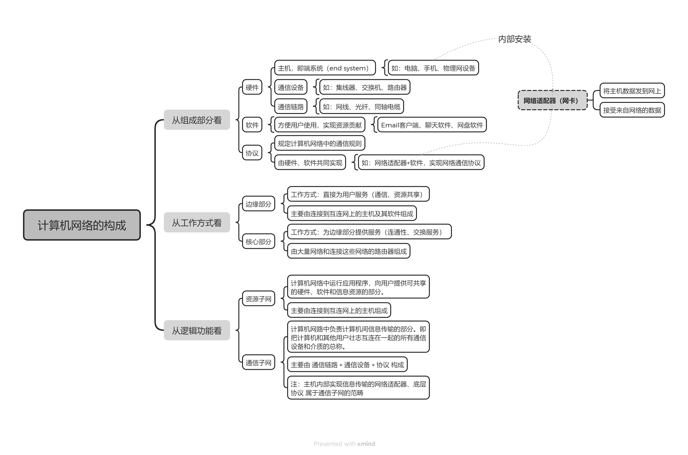
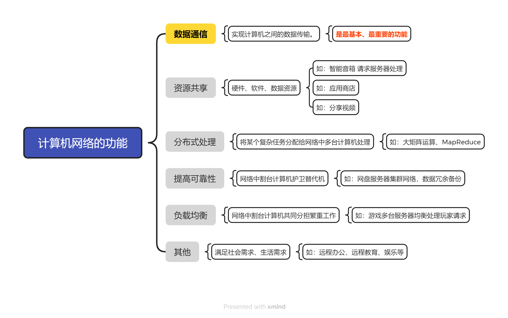
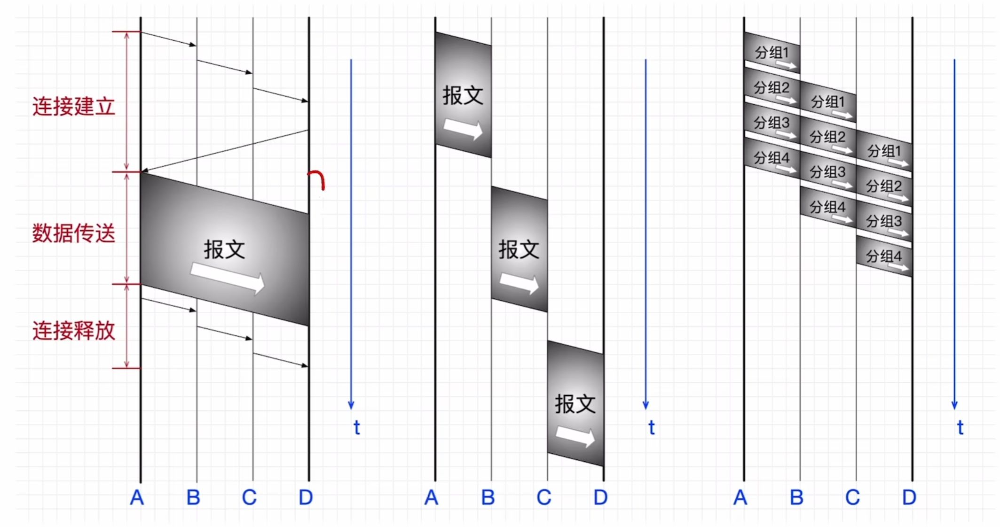
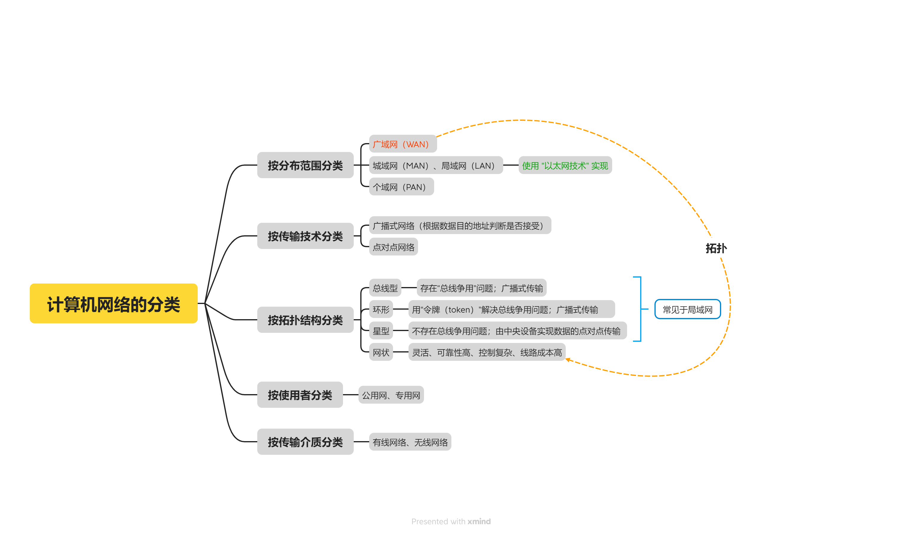
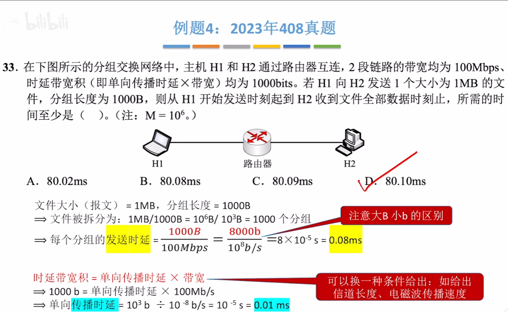
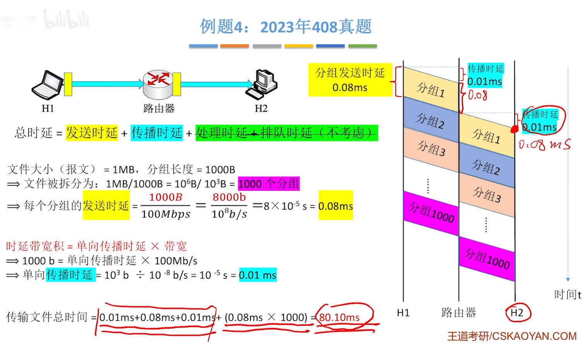
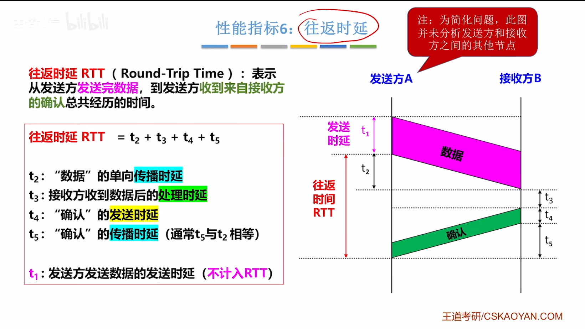
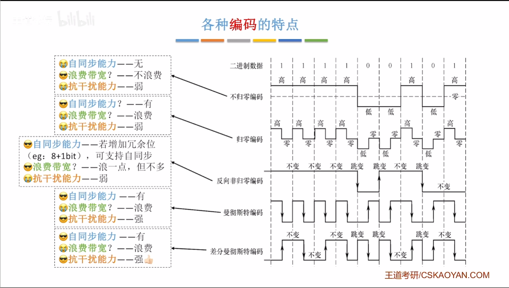
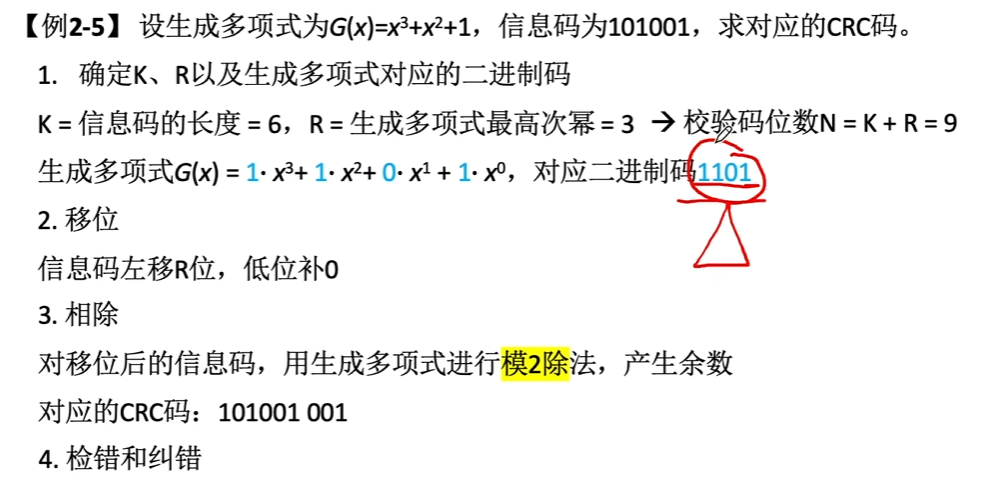
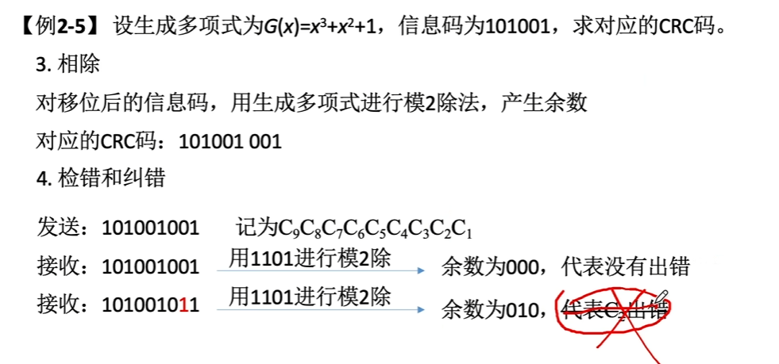

# **Computer Networks 计算机网络**
## 第一章 计算机网络体系结构
*第一天 时间：2026年4月14日 天气：小晴 心情：想去踢球没去成*
>今日学习目标：
>>- [√]1.计算机网络的概念
>>- [√]2.计算机网络的组成和功能

### 1.计算机网络的概念
#### 章节概念
1. **计算机网络(Computer Networks，简称 网络)**：是一个将众多分散的、自治的计算机系统，通过通信设备与线路连接起来，由功能完善的软件实现资源共享和信息传递的系统。由若干个 **结点(node)** 和链接这些结点的 **链路(link)** 组成。
2. **结点** 可以是计算机、集线器、交换机、路由器等
3. **集线器(Hub)**：
    1. 可以把多个结点链接起来，组成一个计算机网络。
    2. 集线器工作在 **物理层(第一层)**。
4. **交换机(Switch)**:
    1. 可以把多个 **结点** 连接起来，组成一个计算机网络。
    2. 交换机可以和交换机相连，构建更大的计算机网络。
    3. 交换机工作在 **数据链路层(第二层)**。
5. **路由器(router)**:
    1. 可以把两个或多个 **计算机网络** 互相连接起来，形成更大的计算机网络，称为 **互连网**。
    2. 路由器可以连接路由器，构建更大的计算机网络。
    3. 路由器工作在 **网络层(第三层)**。
##### 路由器连接的是网络，集线器和交换机连接的结点
6. **互联网(或因特网，Internet)**：由各大ISP(Internet Service Provider)和国际机构组件的，覆盖全球范围的 **互连网(internet)**.
7. **互联网** 必须使用 **TCP/IP协议** 通信，互连网可以使用任意协议进行通信。

### 2.计算机网络的组成和功能
#### 章节概念
1. **计算机网络的构成**

2. **计算机网络的功能**

*第二天 时间：2026年4月15日 天气：依旧晴 心情：不想改PPT*
>今日学习目标：
>>- [√]1.电路交换、报文交换、分组交换
>>- [√]2.三种交换方式的性能分析

### 1.电路交换、报文交换、分组交换
#### 章节概念
1. **电路交换**：
    1. 通过物理线路连接的形式，动态地分配传输线路资源
    2. **电话网络** 采用 “电路交换” 技术
    3. 电路交换的过程
        1. 建立连接（尝试占用通信资源）
        2. 通信（一直占用通信资源）
        3. 释放连接（归还通信资源）
    4. 优缺点：
        1. 优点：数据直送，传输效率高
        2. 缺点：建立/释放连接，需要额外的时间开销；线路被通信双方独占，利用率低；线路分配的灵活性差；交换节点不支持“差错控制”（无法发现传输过程中的数据错误）
    5. 电路交换更适合用于：**低频次、大量地**  传输数据
2. **报文交换**
    1. **电报网络** 采用报文交换技术
    2. 传输数据采用 **报文(message)**，包括控制信息（发送方/接收方）和用户数据（内容）
    3. 优缺点：
        1. 优点：通信前 **无需** 建立连接；数据以 **“报文”** 为单位被交换节点间 **“存储转发”**，通信线路可以灵活分配；在通信时间内，两个用户无需独占一整条物理路线。相比于电路交换，线路利用率高；交换节点支持“差错控制”（通过校验技术）
        2. 缺点：报文不定长，不方便存储转发管理；长报文的存储转发时间开销大、缓存开销大；长报文容易出错，重传代价高
3. **分组交换**
    1. 报文不定长，分组定长。分组的控制信息包括：源地址、目的地址；**分组号** 等
    2. 相比于报文交换，分组交换改进如下问题：
        1. 分组定长，方便存储转发管理
        2. 分组的存储转发时间开销小、缓存开销小
        2. 分组不易出错，重传代价低
    3. 优缺点：
        1. 优点：通信前 **无需** 建立连接；数据以 **分组** 为单位被交换节点间 **存储转发**，通信可以灵活分配；在通信时间内，两个用户 **无需独占** 一条物理线路。相比于电路交换，线路利用利率高；交换节点支持 **差错控制**（通过校验技术）
        2. 缺点：相比于报文交换，控制信息占比增加；相比于电路交换，依然存在存储转发时延；报文被拆分为多个分组，传输过程中可能出现 **失序、丢失** 等问题，增加处理的复杂度
4. **虚电路交换（基于分组交换，后续会学习）**
    1. 建立连接（虚拟电路）
    2. 通信（分组按序、按已建立好的既定线路发送，通信双方不独占线路）
    3. 释放连接
##### 现代计算机通信采用 分组交换 技术

#### 补充批注
1. **“三网”** 包括：电信网（电话网络）、广播电视网、互联网（计算机网络）

### 2.三种交换方式的性能分析
#### 章节概念
要明确三种交换方式的运行逻辑

**三种交换方式的性能分析**
||电路交换|报文交换|分组交换|
|----|----|----|----|
|**完成传输所需时间**|最少（排除建立/释放连接耗时）|最多|较少|
|存储转发时延|无|较高|较低|
|通信前是否需要建立连接|是|否|否|
|缓存开销|无|高|低|
|是否支持差错控制|不支持|支持|支持|
|报文数据有序到达|是|是|否|
|是否需要额外的控制信息|否|是|是（控制信息占比最大）|
|线路分配灵活性|不灵活|灵活|非常灵活|
|线路利用率|低|高|非常高|

*第三天 时间：2026年4月16日 天气：有点阴 心情：运动会停课，早上起不来*
>今日学习目标：
>>- [√]1.计算机网络的分类
>>- [√]2.计算机网络的性能指标

### 1.计算机网络的分类
#### 章节概念
1. **计算机网络的分类**：

### 2.计算机网络的性能指标
#### 章节概念
1. **信道**
    表示向某一方向传送信息的通道（信道≠通信线路），一条通信线路在逻辑上往往对应一条发送信道和一条接收信道
2. **速率(Speed)**
    1. 指连接到网络上的节点在 **信道** 上传输数据的速率。也称数据率或比特率、**数据传输速率**
    2. 速率单位：bit/s , b/s , **bps**
    3. **注意**： 
        1. 有时也会用 B/s(**1B=8b**，B=Byte字节，b=bit比特)
        2. **速率换算** 是10的3次方，**存储换算** 是2的10次方。单位：k M G T
3. **带宽(bandwidth)**
    1. 某信道所能传送的 **最高数据率**
    2. 节点间通信实际能达到的 **最高速率**，由带宽、节点性能共同限制
4. **吞吐量(Throughput)**
    1. 指单位时间内通过某个网络（或信道、接口）的 **实际数据量**。
    2. 吞吐量受带宽限制、受复杂的网络负载情况影响。
5. **时延(Delay)**
    1. 指数据（一个报文或分组，甚至比特）从网络（或链路）的一端传送到另一端所需的时间。又是也称为 **延迟** 或 **迟延**
    2. **总时延 = 发送时延 + 传播时延 + 处理时延 + 排队时延**
        1. **发送时延**：又名传输时延，节点将数据推向信道所花的时间。数据长度(bit)/发送速率(bit/s)
        2. **传播时延**：电磁波在信道中传播一定的距离所花的时间。**不为传输时延**。信道长度(m)/电磁波在信道中的传播速度(m/s)
        3. **处理时延**：被路由器处理所花的时间（如：分析首部、查找存储转发表）
        4. **排队时延**：数据排队进入、排队发出路由器所花的时间
        5. **路由器** 需要进行处理分组，即 **存储转发**，分组太多则需要排队
    3. **每经过一条信道，就会产生一次发送时延和一次传播时延；每经过一次中间节点，就会产生一次处理时延和排队时延**
6. **时延带宽积**
    1. **时延带宽积(bit) = 传播时延(s) * 带宽(bit/s)**
    2. 含义：一条链路中，已从发送端发出但尚未到达接收端的最大比特数
    3. 时延带宽积用于设计最短帧长（后续学习）
    4. **例题**
        
        
7. **往返时延RTT(Round-Trip Time)**
    1. 表示从发送方 **发送完数据**，到发送方 **收到来自接收方的确认** 总共经历的时间。
    2. **图解**
        
8. **信道利用率**
    1. 某个信道有百分之多少的时间是有数据通过的。
    2. 信道利用率 = 有数据通过的时间 / (有数据通过的时间 + 没有数据通过的时间)
    3. **补充**：
        1. 信道利用率 **不能太低，浪费资源**
        2. 信道利用率 **不能太高，容易导致网络拥塞** 

*第四天 时间：2026年4月18日 天气：晴的有点热 心情：困*
>今日学习目标：
>>- [√]1.计算机网络分层结构

### 1.计算机网络分层结构
#### 章节概念
1. **“分层”的设计思想**：将庞大而复杂的问题，转化为若干较小的局部问题。
2. **三种常见的计算机网络体系结构**：
    1. **OSI参考模型** （法律上的标准），由国际标准化组织ISO提出
        应用层->表示层->会话层->运输层->网络层->数据链路层->物理层
    2. **TCP/IP模型** （事实上的标准），美国国防部阿帕网（ARPANET）项目的后续成果
        应用层->传输层->网际层->网络接口层
    3. **五层模型** （教学用标准）
        应用层->传输层->网络层->数据链路层->物理层
3. **网络体系结构**：计算机网络的各层及其协议的**集合**，就是这个计算机网络及其构件所应完成的 **功能的精确定义（不涉及实现）**。
4. **实现**：遵循这种体系结构的前提下，用何种硬件或软件完成这些功能的问题。
5. **体系结构是抽象的，而实现则是具体的**
6. **实体**：在计算机网络的分层机构中，第n层中的活动元素（软件+硬件）通常成为第n层实体。不同机器上的同一层成为**对等层**，同一层的实体成为**对等实体**。
7. **协议**
    1. 即“网络协议”，是控制对等实体之间进行通信的规则的集合，**是水平的**。
    2. 三要素：**语法、语义、同步**
        1. 语法，数据与控制信息的格式（SDU、PCI的格式）
        2. 语义，需要发出何种控制信息、完成何种动作及做出何种应答
        3. 同步（**时序**），执行各种操作的条件、时序关系等，即时间实现顺序的详细说明
8. **接口**：即同一节点内**相邻两层的实体**交换信息的逻辑接口，又称为**服务访问点**。
9. **服务**：指下层为紧邻的上层提供的功能调用，**是垂直的**。
10. **PDU、SDU、PCI的概念**
    1. **协议数据单元（PDU）**：对等层次之间传送的数据单位。第n层的PDU记为 n-PDU
    2. **服务数据单元（SDU）**：为完成上一层实体所要求的功能而传送的数据。第n层的SDU记为n-SDU
    3. **协议控制信息（PCI）**：控制协议操作的信息。第n层的PCI记为n-PCI
    4. 三者的关系为 **n-SDU + n-PCI = n-PDU = (n-1)-SDU**

*第五天 时间：2026年4月20日 天气：雨后晴 心情：到教学楼下自行车掉链子，课本在自习室，自习室没开门*
>今日学习目标：
>>- [√]1.OSI参考模型
>>- [√]2.TCP/IP模型

### 1.OSI参考模型
#### 章节概念
1. **OSI参考模型分层记忆口诀：“物链网输会示用”**
2. **物理层**任务：实现相邻节点之间 **比特（0/1）的传输**
    1. 需要定义 **电路的接口参数**（形状、尺寸、引脚数）
    2. 需要定义 **传输信号的含义、电气特征**（5V表示1，1V表示0；每比特电信号持续时间0.1ms）
    3. 采用 **比特** 进行数据传输，会受到外界噪声的干扰，所以引入第二层 **链路层**
3. **链路层**任务：确保相邻节点之间的链路 **逻辑上无差错**
    1. **差错控制**：检错+纠错 或 检错+丢弃+重传 **最重要功能**
    链路的实体之间以 **帧(Frame)** （含多个比特）为单位进行数据传输需使用检验编码技术
    2. **流量控制**：协调两个结点的速率。过快会丢帧；过慢会浪费资源
    3. 现实中，两个节点往往 **不会直接相连**，此时需要通过 **网络层** 进行连接
4. **网络层**任务：把 **分组**从源节点转发到目的结点
    1. **路由选择**：构造并维护路由表，决定分组到达目的节点的最佳路径 **最重要功能**
    2. **分组转发**：将“分组”从合适的端口转发出去
    网络层的 **对等实体** 之间以 **分组Packet(又称数据报)** 进行数据传输
    3. **拥塞控制**：发现网络拥塞，并采取措施缓解拥塞
    4. **网际互联**：实现异构网络互联
    5. **差错控制、流量控制**：
        1. 数据链路层数据传输单位是 帧，网络层数据传输的单位是 分组；一个分组可以拆分成多个帧
        2. **数据链路层** 只能保证部分帧率是正确的，不能保证全局是正确的，所以需要 **网络层** 也进行差错控制和流量控制
    6. **连接建立与释放**：先建立一条 **虚电路**，确保分组有序、不重复到达
    7. **可靠传输管理**：接收方需返回，分组确认消息
5. **传输层**任务：实现 **端到端** 通信（即实现 **进程到进程** 的通信，“端” 指 “端口”）
    1. **复用和分用**：发送端几个高层实体复用一条低层的连接，在接收端再进行分用
    2. 其他功能：差错控制、流量控制、连接建立与释放、可靠传输管理
    1. 每个进程有自己专属的 **端口号**
    2. 传输层之间用 **报文段** 为单位进行数据传输；报文段可以 **拆分** 成多个分组
6. **会话层**任务：管理进程间会话
    1. **会话管理**：采用检查点机制，当通信失效时候从检查点继续恢复通信，断点续传
7. **表示层**任务：解决不同主机上信息表示不一致的问题
    1. **数据格式转换**：编码转换、压缩/解压、加密/解密
8. **应用层**任务：实现特定的网络应用
    1. 功能繁多，根据应用需求设计
9. **总结：各层数据传输单位**
    1. 物理层 -> 比特(bit)
    2. 数据链路层 -> 帧(Frame)
    3. 网络层 -> 分组(Packet)
    4. 传输层 -> 报文段(Segment)
    5. 会话层和表示层 -> 不会对数据进行拆分
    6. 应用层 -> 报文(Message)

### 2.TCP/IP模型
#### 章节概念
1. **TCP/IP模型分层记忆口诀：“接网输用”**
2. TCP/IP模型 **删去表示层和会话层**：并不是所有的网络应用都需要数据格式转换、会话管理功能。TCP/IP模型理念：如果需要，就交给 **应用层** 的特定协议去完成
3. TCP/IP模型在网络层之下，**只有一层是网络接口层**，任务：实现相邻结点间的数据传输（为网络层传输 **分组**）。但具体实现不做规定
4. **OSI参考模型 vs TCP/IP模型**
 

## 第二章 物理层
*第六天 时间：2026年4月28日 天气：晴 心情：昨晚足球比赛7：0，但我没进球，可惜*
>今日学习目标：
>>- [√]1.通信基础的基本概念
>>- [√]2.信道的极限容量

### 1.通信基础的基本概念
#### 章节概念
1. **信源、信宿、信号、信道**
    1. 信源：信号的来源（即数据的发送方）
    2. 信宿：信号的“归宿”（即信号的接收方）
    3. 信号：数据的载体，分为 **数字信号（信号值是离散的）** 和 **模拟信号（信号值是连续的）**，每一个信号（二进制码）就是一个“码元”，“信号周期” 称为 “码元宽度”
    4. 信道：信号的通道，包含 **发送信道** 和 **接收信道**
2. **码元和比特的关系**：如果一个“周期”内可能出现 K 种信号，则：**1码元 = log(2) K bit**
3. **数据传输速率**
    1. **波特率**：每秒传输几个码元，单位：码元/秒，或 波特(Baud)
    2. **比特率**：每秒传输几个比特，单位：bit/s，或b/s，bps
    3. 这里需要关注一个码元携带几个比特

### 2.信道的极限容量
#### 章节概念
1. **奈奎斯特定理（奈氏准则）**：对于一个理想低通信道（ **没有噪声** 、带宽有限的信道），**极限波特率 = 2W**（单位：波特，即 码元/秒），W是信道的频率带宽（单位：Hz ）**极限波特率 = 2W * log(2) K b/s**
    1. 如果波特率太高，会导致“码间串扰”，即接收方无法识别码元
    2. 带宽越大，信道传输码元的能力越强
    3. 奈奎斯特定理并未对一个码元最多可以携带多少比特做出解释
2. **香农定理**：对于一个 **有噪声** 、带宽有限的信道，**极限比特率 = W * log(2) (1+S/N)**（单位：b/s），W是信道的频率带宽（单位：Hz ），S/N 是信噪比（信号的功率/噪声的功率）
    1. 提高信道带宽、加强信号功率、降低噪声功率，都可以提高信道的极限比特率
3. **分贝记法**：10 * log(10) S/N (单位：dB)

*第七天 时间：2026年5月7日 天气：晴 心情：晚上开组会怎么办*
>今日学习目标：
>>- [√]1.编码和调制
>>- [√]2.传输介质

### 1.编码和调制
#### 章节概念
1. **编码**：二进制数据 -> 数字信号
   **解码**：数字信号 -> 二进制数据
2. **调制**：二进制数据 -> 模拟信号
   **解调**：模拟信号 - > 二进制数据
3. **常用的编码方式**
    1. **不归零编码**：NRZ，低0高1，（信号周期）中不变。需要额外配置时钟，长连1/0会丢失同步
    2. **归零编码**：RZ，低0高1，中归零。含有自同步时钟
    3. **反向归零编码**：NEZI，跳0不跳1看起点，中不变
    4. **曼彻斯特编码**：跳0反跳1看中间，中必变。**通常为上0下1**。**以太网默认使用曼彻斯特编码**
    5. **差分曼彻斯特编码**：跳0不跳1看起点，中必变
4. **各种编码的特点**
 
5. **自同步能力**：信源和信宿可以根据信号完成“节奏同步”，无需时钟信号
6. **区分曼彻斯特和差分曼彻斯特**：如果 **中间跳变方向和二进制** 能够一一对应，就是曼彻斯特

7. **调制方法**
    1. **调幅AM（幅移键控ASK）**
    2. **调频FM（频移键控FSK）**
    3. **调相PM（相移键控PSK）**
    4. **正交幅度调制（QAM）**：将AM，PM结合起来，形成叠加信号

### 2.传输介质
#### 章节概念
1. **常用传输介质**
    1. **导向型（信号超固定方向传播）**：双绞线、同轴电缆、光纤
    2. **非导向型（信号朝四面八方传播）**：无线传输介质
2. **双绞线**：由两根的导线相互绞合而成。有较好的抗干扰能力。绞合、屏蔽层可以提升电磁干扰能力。
    1. 有屏蔽层 = 屏蔽双绞线(STP)
    2. 没有屏蔽层 = 非屏蔽双绞线(UTP)
    3. 提升抗干扰性：提高绞合度、增加屏蔽层
3. **抗电磁干扰能力强 -> 信道噪声功率低 -> 信道极限功率高**
4. **同轴电缆**：由 **内导体** （用于传输信号）和 **外导体屏蔽层**（用于抗电磁干扰）构成。有较好的抗干扰能力。
    1. 内导体越粗，电阻越低，传输过程中信号衰减减少，传输距离越长
5. **光纤**：由 **纤芯**（高折射率）和 **包层**（低折射率）构成。利用光的全反射特性，在纤芯内传输光脉冲信号。
    1. **单模光纤**：只有 **一条光线** 在一根光纤中传输，适合 **长距离** 传输，信号传输损耗小
        1. 纤芯更细，直径小于一个波长，**（几乎不会发生全反射）** 只能传输 **一条光线**，信号传输损耗低
    2. **多模光纤**：**多条光线** 在一根光纤中传输，适合 **近距离** 传输，远距离传输光信号容易失真
        1. 纤芯更粗，可同时传输 **多条光线**，信号 **传输损耗更高**
    3. 抗干扰能力非常好。光信号对电磁信号不敏感
    4. 信号传输损耗小，长距离传输时中继器少；很细很省布线空间

6. **以太网对有线传输介质的命名规则**：**速度 + Base + 介质信息**，Baseband，基带传输，即传输数字信号（采用曼彻斯特编码）
    1. **Base后跟数字** -> **同轴电缆**：10Base5 —— 10Mbps，同轴电缆，最远传输距离500m
    2. **Base后跟F** -> **光纤**：10BaseFL，10BaseFB，10BaseFP
    3. **Base后跟T** -> **双绞线**：10BaseT1S，10BaseT1L

7. **无线传输介质**（本质都是电磁波）
    1. **无线电波**：穿透力能强、传输距离长、信号指向性弱
    2. **微波信号**：频率宽带高、信号指向性强、保密性差（容易被窃听）
        1. 波长越短，“信号指向性”越强，信号趋向于直线传播
        2. 波长越长，“绕射性”越好
        3. 频率越高，数据传输能力越强
        4. **波长和信号频率呈反比**
    3. 红外线通信、激光通信等：信号指向性强
    4. **长波** 更适合长距离、非直线通信。**短波** 更适合短距离、高速通信，若用于长距离通信则需建立中继站，**短波**信号指向性强，要求信号接收器“对准”信号源

8. **物理层接口的特性**
    1. **机械特性**：指明接口所用接线器的形状和尺寸、引脚数目和排列、固定和锁定装置 等
    2. **电器特性**：指明在接口电缆的各条线上出现的电压的范围、传输速率、距离限制 等
    3. **功能特性**：指明某条线上出现的某一电平的电压的意义
    4. **过程特性（规程特性）**：指明对于不同功能的各种可能时间的出现顺序

*第八天 时间：2026年5月9日 天气：晴 心情：小组出线*
>今日学习目标：
>>- [√]1.物理层设备

### 1.物理层设备
#### 章节概念
1. **中继器Repeater**
    1. 中继器只有两个端口。另一个端口接收信号，将失真信号**整形再生，并转发至另一个端口**（信号再生会产生一些时延）
    2. 仅支持**半双工通信**（两端连接的结点**不可同时发送**数据，会导致冲突）
    3. 中继器两个端口对应两个**网段**
2. **集线器Hub**
    1. 本质上是**多端口中继器**。集线器将其中一个端口接收到的信号整形再生后，转发到所有其他端口
    2. 各端口连接的结点**不可同时发送**数据，会导致冲突
    3. 集线器的N个端口对应N个**网段**，各网段属于同一个**冲突域**
    4. 集线器设备**不能隔离冲突域**，**以太网交换机可以隔离冲突域**
3. **冲突域**：如果两台主机同时发送数据会导致冲突，则这两台主机处于同一个“冲突域”。处于同一冲突域的主机在发送数据前需要进行**信道争用**

4. **集线器、中继器的一些特性**
    1. 集线器、中继器**不能“无限串联”**
    2. **集线器**连接的网络，**物理上是星型拓扑，逻辑上是总线型拓扑**；数据“广播式”传播，存在**信道争用**的问题
    3. 集线器连接的各网段**共享带宽**
    4. *集线器 可以连接不同的传输介质，因此两个网段的物理层接口特性可以不同（这就意味着集线器连接的网段，“物理层”可以不同）*
    5. *集线器 如果连接了速率不同的网段，会导致网段“速率向下兼容”*

## 第三章 数据链路层
*第九天 时间：2026年5月10日 天气：大晴 心情：好累，日程安排好满*
>今日学习目标：
>>- [√]1.数据链路层的功能
>>- [√]2.组帧

### 1.数据链路层的功能
#### 章节概念
1. 数据链路层 使用 物理层 提供的 **比特传输** 服务。数据链路层 为 网络层 提供服务，将网络层的 **IP数据报（分组）** 封装成 **帧** ，传输给下一个相邻结点
2. **物理链路**：传输介质（0层）+物理层（1层）实现了相邻结点之间的“物理链路”
3. **逻辑链路**：数据链路层需要基于“物理链路”，实现相邻结点之间逻辑上无差错的“数据链路（逻辑链路）”

4. **数据链路层的功能**
    1. **封装成帧（组帧）**
        1. **帧定界**：如何让接受方能够确定帧的界限
        2. **透明传输**：接收方链路层要能从收到的帧内恢复原始的SDU，让网络层“感受不到”将分组封装成帧的过程
    2. **差错控制**：发现并解决一个帧内部的**位错**
        1. 解决方案一：接收方发现比特错后**丢弃帧**，发送方**重传帧**（仅需采用 *检错编码*）
        2. 解决方案二：**由接收方发现并纠正比特错误**（需采用 *纠错编码*）
    3. **可靠传输**：发现并解决“帧错”
        1. **帧丢失**
        2. **帧重复**
        3. **帧失序**
    4. **流量控制**：控制发送方发送帧的速率别太快，让接收方“来得及”接收
    5. **介质访问控制**
        1. **广播信道**需要实现此功能。在逻辑上是总线型拓扑，**多个结点需争抢传输介质的使用权**
        2. **点对点信道**通常不需要实现此功能。通常意味着**两个结点之间有专属的传输介质，不用抢**

### 2.组帧
#### 章节概念
1. **组帧方法**
    1. **字符计数法**：在每个帧开头，用一个**定长计数字段**表示帧长。
        1. 帧长 = 计数字段长度+帧的数据部分长度
        2. **最大缺点**：任何一个计数字段出错，都会导致后续所有帧无法定界
    2. **字节填充法**：在每个帧的首部添加**控制字符SOH（00000001）**和**控制字符EOT（00000100）**
        1. 如果帧的数据部分包含“特殊字符”，则**发送方**需要在这些“特殊字符”**前**填充**转义字符ESC**（**接收方**要做**逆处理**）
    3. **零比特填充法**：在每个帧的首部添加**特殊比特串（01111110）**
        1. **发送方**需要对帧的数据部分进行处理，**每当遇到连续5个1，就填充一个0**
        2. **接收方**需要对真的数据部分进行逆处理，**每当遇到连续5个1，就删掉后面的0**
        3. **HDLC协议和PPP协议使用零比特填充法进行组帧**
    4. **违规编码法**：使用“违规信号”，表示帧的开头、结尾（这种方法需要和物理层配合）

*第九天 时间：2026年5月13日 天气：阴 心情：高兴，入选校青马工程，23/181*
>今日学习目标：
>>- [√]1.检错编码（奇偶校验码）
>>- [√]2.检错编码（循环冗余校验码）

### 1.检错编码（奇偶校验码）
#### 章节概念
1. **差错控制**
    1. **目标**：发现并解决一个帧内部的**位错**
    2. **解决方案一**：接收方**发现比特错**后**丢弃帧**，并通知发送方**重传帧**
        1. **检错编码**：***奇偶检验码***，***CRC校验码（循环冗余校验码）***
    3. **解决方案二**：由接收方**发现并纠正比特错误**
        1. **纠错编码**：***海明校验码***
2. **奇偶检验码**
    1. **奇校验码**：整个校验码（有效信息位和校验位）中的“1”的个数为奇数
    2. **偶校验码**：整个校验码（有效信息位和校验位）中的“1”的个数为偶数
    3. 现实中偶校验更加常用，更容易实现**异或（模2加）**运算
    3. **仅能检测出 *奇数位* 错误，无纠错能力**
3. **异或运算（模2加）**
    1. 两比特相“异”时，结果为 1
    2. 将“偶校验”的信息位、校验位全部异或，**若结果为0，说明没有错误**

|奇偶校验位置|有效信息位|
|----|----|
|1位|n位|

### 2.检错编码（循环冗余校验码，CRC码）
#### 章节概念

|信息位|校验位|
|----|----|
|K位|R位|

1. **基本思想**
    1. 数据发送、接收方约定一个**除数**
    2. K个信息位 + R个检验位 作为**被除数**，添加校验位后需保证除法的余数为0
    3. 收到数据后，进行**除法**检查余数是否为0
    4. 若**余数非0**，说明出错，则进行重传或纠错
2. **CRC校验码例题**

3. K个信息位，R个检验位，若生成多项式选择得当，且**2^R ≥ K+R+1**，则CRC码可纠正1位错
