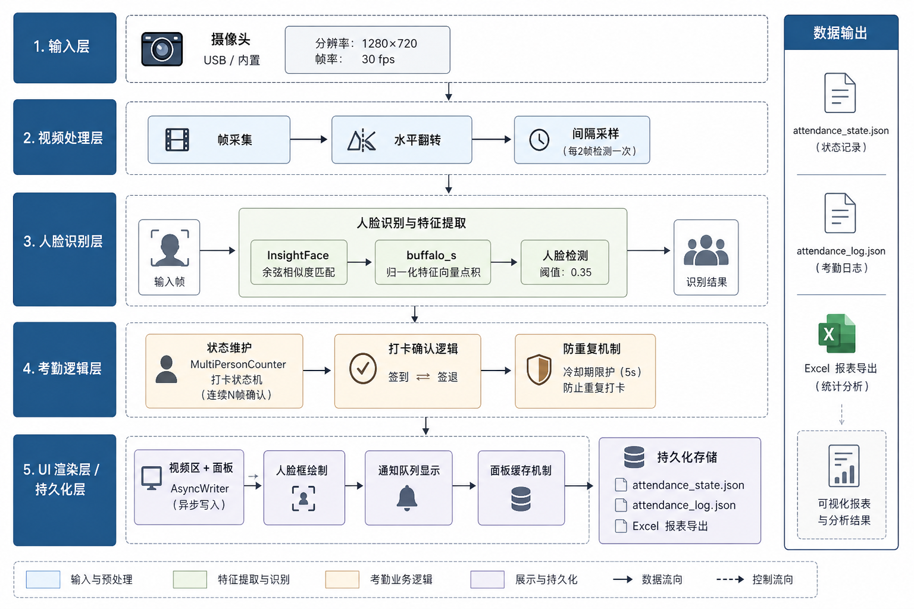
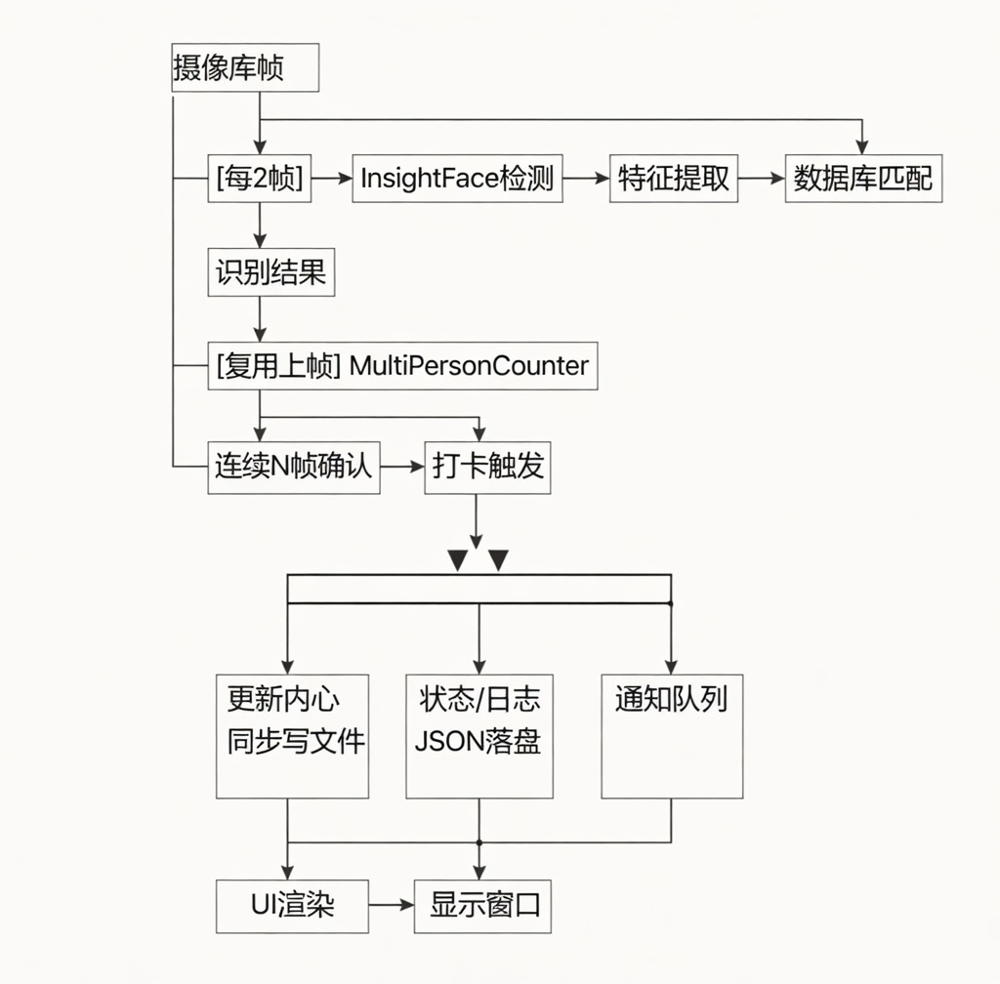
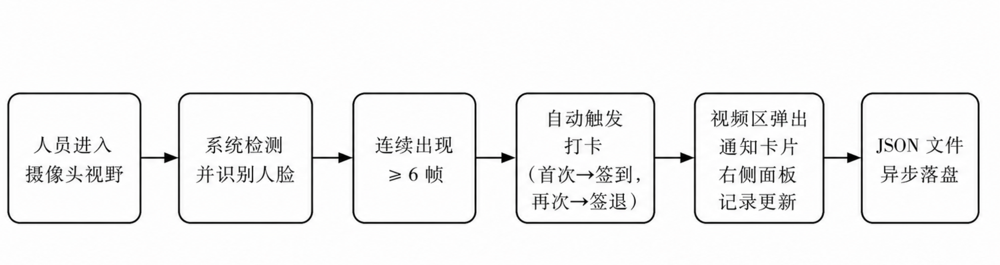

# 人脸识别智能考勤管理系统

## Face Recognition Intelligent Attendance Management System

---
> **版本** v1.0.0 ｜ **语言** Python 3.10+ ｜ **许可** MIT License
>
> 基于深度学习人脸识别技术的实时考勤管理解决方案，支持多人同框并发打卡、自动工时统计与 Excel 报表导出。
---

## 目录
1. 项目概述
2. 系统架构
3. 核心技术
4. 功能特性
5. 环境依赖
6. 快速开始
7. 目录结构
8. 配置说明
9. 核心模块详解
10. 性能指标
11. 已知限制
12. 后续规划
13. 参考资料

---
## 1. 项目概述

### 1.1 背景

传统考勤方式（打卡机、签到表、指纹识别）在多人并发场景下存在效率低下、易造假、数据处理繁琐等问题。随着深度学习在计算机视觉领域的快速发展，基于人脸识别的非接触式考勤系统逐渐成为企业数字化管理的主流方向。

本项目基于 **InsightFace** 深度学习框架，结合 **OpenCV** 实时视频处理能力，构建了一套完整的人脸识别考勤管理系统，实现了从人脸检测、身份识别、打卡确认到报表导出的全流程自动化。

### 1.2 目标
✔ 无接触式实时人脸识别打卡
✔ 多人同框场景下的并发考勤处理
✔ 自动计算工时与检测考勤异常
✔ 实时可视化 UI 显示
✔ 一键导出标准化 Excel 考勤报表
✔ 轻量化部署，支持普通 PC 运行

### 1.3 适用场景

| 场景 | 说明 |
|------|------|
| 中小型企业 | 日常员工签到/签退管理 |
| 教育机构 | 课堂出勤记录 |
| 会议室管理 | 参会人员自动签到 |
| 实验室/工作室 | 成员进出记录 |

---
## 2. 系统架构

### 2.1 整体架构图



### 2.2 数据流图



---
## 3. 核心技术

### 3.1 人脸检测与识别

本系统采用 **InsightFace** 的 `buffalo_s` 轻量级模型进行人脸检测与特征提取。

**识别算法：余弦相似度**

$$\text{similarity} = \cos(\theta) = \frac{\vec{e}_1 \cdot \vec{e}_2}{|\vec{e}_1||\vec{e}_2|}$$

由于 InsightFace 输出的特征向量已归一化（$|\vec{e}| = 1$），计算简化为：

$$\text{similarity} = \vec{e}_{input} \cdot \vec{e}_{database}$$

当相似度超过阈值 $\tau = 0.35$ 时，判定为同一人。

```python
def _recognize(self, emb) -> str | None:
    best_name, best_sim = None, -1.0
    for name, db_emb in self.face_db.items():
        sim = float(np.dot(emb, db_emb))   # 归一化向量直接点积
        if sim > best_sim:
            best_sim = sim
            best_name = name
    return best_name if best_sim >= SIMILARITY_THRESHOLD else None
```

### 3.2 多人帧计数确认机制

为避免单帧误识别触发打卡，系统引入连续帧计数确认机制：

> 检测到同一人连续出现 ≥ N 帧 → 触发打卡
> 离开画面 → 计数清零
> 触发后 → 计数重置，等待冷却期结束

### 3.3 视频区坐标变换

摄像头帧经过 crop_fill（等比缩放+居中裁剪）适配到视频显示区，人脸检测在原始帧坐标系下进行，绘制时需做坐标变换：

$$
\begin{aligned}
x_{display} &= x_{original} \times s - c_x \\
y_{display} &= y_{original} \times s - c_y
\end{aligned}
$$

其中
$$
s = \max\left( \frac{W_{video}}{W_{frame}},\ \frac{H_{video}}{H_{frame}} \right)
$$
$s$ 为缩放比，$(c_x,c_y)$ 为裁剪偏移量。

### 3.4 面板缓存策略
右侧信息面板每次渲染需调用 PIL 进行中文文字绘制（涉及 BGR↔RGB 两次颜色空间转换），开销较大。

系统采用 **TTL 缓存** 机制：

> 上次渲染时间距今 < 0.5s   →  返回缓存图像
> 打卡事件发生              →  强制使缓存失效（cache_ts = 0）
> 窗口尺寸变化              →  强制重绘

## 4. 功能特性

### 4.1 核心功能

| 功能         | 描述                                   | 实现方式               |
| ------------ | -------------------------------------- | ---------------------- |
| 实时人脸检测 | 摄像头实时捕获，每2帧检测一次          | InsightFace buffalo_s  |
| 身份识别     | 余弦相似度匹配注册人员                 | 归一化特征向量点积     |
| 自动签到/签退| 状态机自动切换，无需手动操作           | 内存状态表维护         |
| 多人并发     | 同一帧多人同时触发打卡                 | 独立帧计数器           |
| 防误触保护   | 连续N帧确认 + 冷却期双重保护           | MultiPersonCounter     |
| 工时统计     | 自动配对签到/签退计算在岗时长         | 栈式配对算法           |
| 异常检测     | 识别未签退、无对应签到等异常           | 考勤规则引擎           |
| 实时通知     | 打卡成功后视频区弹出通知卡片           | NotificationQueue      |
| 报表导出     | 4 Sheet 标准化 Excel 报表              | openpyxl 样式渲染      |
| 数据持久化   | JSON 文件异步落盘，断电不丢数据        | AsyncWriter            |

### 4.2 UI 界面


### 4.3 Excel 报表结构


## 5. 环境依赖

### 5.1 运行环境

| 项目 | 要求 |
|------|------|
| 操作系统 | Windows 10/11（字体路径依赖） |
| Python | 3.10 及以上 |
| 摄像头 | USB 摄像头或内置摄像头 |
| 内存 | 建议 4GB 以上 |
| CPU | 支持 AVX2 指令集（InsightFace 需要）|

### 5.2 Python 依赖包

```Bash
# 核心依赖
insightface>=0.7.3      # 人脸检测与识别
opencv-python>=4.8.0    # 视频采集与图像处理
numpy>=1.24.0           # 数值计算（特征向量运算）
Pillow>=10.0.0          # 中文文字渲染

# 报表导出
openpyxl>=3.1.0         # Excel 文件读写与样式

# 标准库（无需安装）
threading / queue / json / os / time / datetime / collections
```

### 5.3 安装方式

```Bash
# 源代码地址
https://github.com/Haoyu-Tian/study-notes-and-projects/blob/main/python-learning/face_attendance/V1.0/attendance_system-V1.0.py

# 创建虚拟环境（推荐）
python -m venv venv
venv\Scripts\activate        # Windows
# source venv/bin/activate   # Linux/macOS

# 安装依赖
pip install -r requirements.txt

# requirements.txt
insightface>=0.7.3
opencv-python>=4.8.0
numpy>=1.24.0
Pillow>=10.0.0
openpyxl>=3.1.0

# InsightFace 模型会在首次运行时自动下载
# 如网络受限，可手动下载 buffalo_s 模型放入 ~/.insightface/models/
```

## 6. 快速开始

### 6.1 准备人员照片

```
known_faces/
├── Zhang San.jpg      # 文件名即为人员姓名，本版本本功能目前只支持英文字符的检测，中文名称会导致后面输出的乱码
├── Li Si.png
└── Wang Wu.jpg

要求：
  - 格式：.jpg 或 .png
  - 每人一张，正面清晰照片
  - 照片中只含一张人脸（确保注册精度）
```

### 6.2 启动系统

```
python attendance_system-V1.0.py
```

### 6.3 操作说明

| 按键 | 功能                                       |
| ---- | ------------------------------------------ |
| E    | 立即导出 Excel 报表（后台异步执行，不中断视频） |
| Q    | 退出系统（自动导出最终报表）                 |

### 6.4 打卡流程




## 7. 目录结构

```
face-attendance-system/
│
├── attendance_system.py      # 主程序文件（系统入口）
├── requirements.txt          # Python 依赖清单
├── README.md                 # 项目说明文档
│
├── known_faces/              # 已知人员照片目录
│   ├── Zhang San.jpg
│   └── Li Si.png
│
├── attendance_reports/       # Excel 报表输出目录（自动创建）
│   └── 考勤报表_2024-01-15.xlsx
│
├── attendance_state.json     # 当日考勤状态（自动生成）
└── attendance_log.json       # 打卡流水日志（自动生成）
```

## 8. 配置说明

所有可调参数集中在文件顶部配置区，无需修改代码逻辑即可调整系统行为。

```python
# ── 识别精度 ──
SIMILARITY_THRESHOLD = 0.35
# 取值范围：0.0 ~ 1.0
# 越高 → 越严格，陌生人更难误识别，但本人也可能识别失败
# 越低 → 越宽松，识别率高，但可能误认他人
# 建议范围：0.30 ~ 0.45

# ── 打卡确认灵敏度 ──
CONFIRM_FRAMES = 6
# 需要连续检测到同一人的帧数才触发打卡
# 越大 → 越稳定，但反应慢；越小 → 反应快，但易误触

# ── 防重复打卡间隔 ──
COOLDOWN_SECONDS = 5
# 同一人两次打卡之间的最短时间间隔（秒）

# ── 检测频率 ──
DETECT_INTERVAL = 2
# 每隔 N 帧执行一次人脸检测
# 越大 → CPU 占用越低，但识别延迟越高
# 建议：普通PC设为2，性能较弱设为3

# ── 摄像头分辨率 ──
CAMERA_WIDTH  = 1280
CAMERA_HEIGHT = 720

# ── 面板比例 ──
PANEL_RATIO = 0.22
# 右侧信息面板占窗口总宽度的比例
```

## 9. 核心模块详解

### 9.1 MultiPersonCounter — 多人帧计数器

```
职责：为每个识别到的人独立维护连续帧计数
      满足阈值后触发打卡，触发后重置计数

状态转换：
  未出现  ──[检测到]──→  计数中(1,2,...,N)
  计数中  ──[≥N帧]───→  已触发（加入打卡队列）
  已触发  ──[消失]───→  重置（允许下次重新触发）
  计数中  ──[消失]───→  重置
```

### 9.2 NotificationQueue — 通知队列

```
职责：管理视频区打卡通知的显示生命周期

特性：
  - 线程安全（threading.Lock）
  - 同一人旧通知自动替换
  - 按到期时间自动清理
  - 淡出效果（剩余时间→透明度映射）
```

### 9.3 AsyncWriter — 异步文件写入器

```
职责：将 JSON 写入操作从主线程解耦，避免磁盘 I/O 阻塞视频帧处理

实现：
  主线程  ──put()──→  Queue  ──取出──→  后台线程写文件
                     (无限队列)           (守护线程)
```

### 9.4 calc_work_sessions — 考勤配对算法

```
输入：原始打卡流水 [签到, 签退, 签到, 签退, ...]

算法：栈式 FIFO 配对
  遇到签到 → 压栈
  遇到签退 → 弹出最早的签到进行配对
  栈为空遇到签退 → 标记"无对应签到"异常
  处理完毕栈非空 → 标记"未签退"异常

输出：
  sessions  - 工作段列表（含时长、异常说明）
  total_dur - 累计有效工时
  anomalies - 异常描述列表
```

## 10. 性能指标

> 以下数据在 **Intel Core i7-14650HX (2.20 GHz) / 16GB RAM (5600 MT/s) /
> NVIDIA GeForce RTX 4060 Laptop GPU 8GB / CUDA 12.7 / Windows 11 64位**
> 环境下实测，当前版本使用 **CPU 推理模式**（`CPUExecutionProvider`），
> GPU 未参与模型推理。

| 指标 | 数值 | 备注 |
|------|------|------|
| 空闲帧率（无人脸）| 28~30 FPS | CPU 占用较低 |
| 识别帧率（有人脸）| 13~15 FPS | CPU 推理瓶颈 |
| 人脸检测延迟 | ~60ms/帧 | buffalo_s CPU模式 |
| 单人识别耗时 | < 5ms | 余弦相似度计算 |
| 内存占用 | ~350MB | 模型加载后稳定 |
| 打卡响应时间 | 约 0.8s | 6帧 × 每2帧检测一次 |
| 支持同框人数 | 实测 ≤ 4 人稳定 | 人数增加帧率进一步下降 |

```
当前瓶颈分析：

推理模式：CPUExecutionProvider（仅使用 CPU）
检测间隔：每 2 帧执行一次人脸检测
帧率表现：有人脸时约 13~15 FPS，低于流畅阈值（20 FPS）

硬件具备 GPU 加速条件：
显卡：NVIDIA GeForce RTX 4060 Laptop GPU（8GB VRAM）
CUDA：12.7 已安装

若切换至 CUDAExecutionProvider 模式（需修改代码），
预计识别帧率可提升至 25~30 FPS，当前版本暂不启用。
```

```
### 不同场景帧率参考

| 场景 | 当前（CPU模式）| 预估（GPU模式）|
|------|--------------|--------------|
| 无人脸 | 28~30 FPS | 28~30 FPS |
| 1人 | 13~15 FPS | 25~28 FPS |
| 2~4人 | 8~12 FPS | 20~25 FPS |
| 4人以上 | < 8 FPS | 15~20 FPS |
```

## 11. 已知限制

> ⚠ **系统局限性说明**：以下为当前版本的已知限制，请在实际部署前充分评估使用场景。

---

### (1) 不支持活体检测

**问题描述：**
当前版本 **不具备活体检测（Liveness Detection）能力**，系统无法区分真实人脸与照片/视频中的人脸：
- 用他人照片对准摄像头可以成功打卡
- 用手机播放他人视频同样可以触发识别
- 存在被他人代替打卡的安全风险

**影响程度：** 🔴 高（安全性缺陷）

**技术原因：**

```
InsightFace buffalo_s 模型仅提供：
✔ 人脸检测
✔ 特征提取
✔ 身份识别

不包含：
✘ 活体检测
✘ 3D 深度判断
✘ 眨眼/点头等动作验证
```

**缓解建议：**
- 本系统适合内部信任环境（如小型团队、实验室）使用
- 高安全性需求场景建议引入专用活体检测模块
- 后续版本规划中考虑集成活体检测能力

---

### (2) 光照敏感

**问题描述：**
人脸识别模型对光照条件较为敏感，在以下环境中识别率会显著下降：
- 强逆光（背对窗户或强光源）
- 极暗环境（夜间无补光）
- 侧光过强导致面部阴影明显

**影响程度：** 🔴 较高

**缓解建议：**
- 部署环境保持正面均匀光照
- 避免摄像头正对窗户或强光源
- 夜间使用建议配备补光灯

---

### (3) 遮挡问题

**问题描述：**
面部关键区域被遮挡时，模型提取的特征向量不完整，相似度计算结果不准确：
- 口罩遮挡下半脸 → 识别率大幅下降
- 帽子/刘海遮挡额头 → 轻微影响
- 墨镜遮挡眼部 → 识别率大幅下降

**影响程度：** 🔴 较高

**缓解建议：**
- 注册照片的拍摄条件与实际使用场景尽量保持一致
- 若员工日常佩戴口罩，建议分别注册佩戴/不佩戴两张照片

---

### (4) CPU 推理性能瓶颈

**问题描述：**
当前版本强制使用 CPU 进行模型推理（CPUExecutionProvider），
即使设备配备独立显卡也不会自动启用 GPU 加速：
- 有人脸时帧率约 13~15 FPS，低于流畅阈值（20 FPS）
- 多人同框（4人以上）时帧率进一步下降至 8 FPS 以下
- 高负载时 CPU 占用率显著升高

**影响程度：** 🟠 中高

**测试环境数据：**
| 场景     | 实测帧率     | 流畅度         |
| -------- | ------------ | -------------- |
| 无人脸   | 28~30 FPS    | ✅ 流畅        |
| 1人      | 13~15 FPS    | ⚠️ 轻微卡顿    |
| 2~4人    | 8~12 FPS     | 🔴 明显卡顿    |
| 4人以上  | < 8 FPS      | 🔴 严重卡顿    |

**缓解建议：**
- 控制同框人数在 4 人以内以保证基本流畅度
- 适当增大 DETECT_INTERVAL 参数（如改为 3）可小幅提升帧率
- 切换至 CUDAExecutionProvider 模式（需修改代码）可大幅改善性能

---

### (5) 单摄像头限制

**问题描述：**
当前版本仅支持单路摄像头（设备索引固定为 `cv2.VideoCapture(0)`）：
- 无法同时监控多个出入口
- 摄像头离线时系统直接退出
- 不支持 RTSP 网络摄像头接入

**影响程度：** 🟡 中等

**缓解建议：**
- 单一出入口场景不受影响
- 多出入口场景需部署多台独立设备分别运行
- 多摄像头统一管理支持在后续版本规划中

---

### (6) Windows 字体依赖

**问题描述：**
中文文字渲染硬编码依赖 Windows 系统内置字体文件：

```python
FONT_PATH      = "C:/Windows/Fonts/msyh.ttc"   # 微软雅黑常规体
FONT_PATH_BOLD = "C:/Windows/Fonts/msyhbd.ttc"  # 微软雅黑粗体
```
在非 Windows 系统上路径不存在，程序启动时直接报错崩溃。
| 操作系统            | 是否可用     | 说明                 |
| ------------------- | ------------ | -------------------- |
| Windows 10/11 正版  | ✅ 正常      | 系统自带微软雅黑     |
| Windows 精简/Ghost版| ⚠️ 可能报错  | 字体可能被删除       |
| macOS               | ❌ 无法运行  | 路径不存在           |
| Linux               | ❌ 无法运行  | 路径不存在           |

**影响程度：** 🟡 中等（跨平台限制）

**缓解建议：**

- 在非 Windows 系统上，修改配置项 FONT_PATH 为本地已安装的中文字体路径
- 例如 macOS：/System/Library/Fonts/PingFang.ttc
- 例如 Linux：/usr/share/fonts/truetype/wqy/wqy-microhei.ttc

---

### (7) 当日数据范围

**问题描述：**

考勤状态与打卡日志均以日期为单位进行隔离存储，存在以下限制：
- 跨日自动重置，昨日在岗状态不延续到今日
- 程序运行中不支持查询历史日期数据
- JSON 文件仅保存最近一天的数据，旧数据被覆盖

**影响程度：** 🟡 中等

**缓解建议：**

- 每日下班后及时按 E 键导出 Excel 报表留存
- 程序退出时会自动导出最终报表
- 历史数据查询需通过已导出的 Excel 报表进行
- SQLite 替代 JSON

---

## 12. 参考资料

> [1] InsightFace: An Open Source 2D&3D Deep Face Analysis Library
    https://github.com/deepinsight/insightface

## 致谢

感谢 InsightFace 团队提供的优秀开源人脸识别框架，使本项目得以在普通CPU设备上实现实时人脸识别功能。项目中所使用的核心算法、模型结构及相实现思路均受益于该项目的开源贡献。
同时，也非常感谢各位技术大佬、开发者和同行们的关注与支持。本人水平有限，项目中难免存在设计不够严谨、代码实现不够优化、算法选型不够合理等问题恳请各位大佬不吝赐教，提出宝贵的修改意见和更优的解决方案。
后续我会持续关注社区的反馈与建议，积极学习和尝试更先进的技术方案，不断对项目进行优化与迭代，提升识别性能与稳定性，完善用户体验。期待能与大家大共同进步，打造一个更高效、更易用的实时人脸识别系统。再次感谢!
